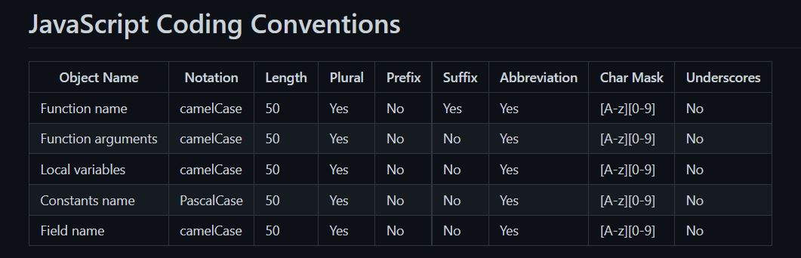

# Clean code & clean architecture
    []: # Language: markdown
    []: # Path: readme.md

1. Clean Code
   1. [Lý do cần viết mã sạch và tầm quan trọng](#Lý-do-cần-viết-mã-sạch-và-tầm-quan-trọng)
   2. Developer as writer
   3. Nguyên tắc viết mã sạch
   4. Naming convention
   5. Write clean methods
   6. Write clean classes
   7. Write clean comments
2. Clean architecture

Clean code like beautiful girl 

Clean architecture like villa

## Clean Code

### Lý do cần viết mã sạch và tầm quan trọng
Có nhiều lý do tại sao viết mã sạch lại quan trọng, tuy nghiên điều quan trọng cần nhớ là **viết mã thì dễ nhưng đọc thì khó**   

    - Làm việc nhóm
    - Có thể tái sử dụng
    - Bạn sẽ cảm thấy thích code của mình hơn, thích làm việc hơn, thích đọc code hơn
    - Bạn sẽ thấy sự phát triển
    
#### Developer as writer
Các bạn đang truyền tải cho các developer khác về TÁC PHẨM của mình,  vì thế các bạn cần phải có một cách để viết mã sạch và một kiến trúc sạch.
### Nguyên tắc viết mã sạch
#### Ba nguyên tắc viết mã sạch
1. Stay native 

Tránh sử dụng một ngôn ngữ này để viết một ngôn ngữ khác thông qua chuỗi ký tự

3. Signal to Noise Ratio

Tín hiệu code tuân thủ theo nguyên tắc TED (**T**erse - Ngắn gọn; **E**xpressive - Hàm ý; **D**oes one thing - Làm một việc cụ thể)

Nhận dạng **Noise**:

 - Có tính lặp lại
 - Class lớn
 - Method dài
 - Độ phức tạp cao
 - Thụt lề quá mức
 - Comments không cần thiết
 - Đặt tên tệ

3. Self-Documenting Code
   - Trình bày ý định một cách rõ ràng để người đọc có thể hiểu chính xác những gì mà đang làm
   - Sử dụng các lớp trừu tượng (abstract)  để đi qua ở các mức độ chi tiết khác nhau 
   - Định dạng dễ đọc để tối ưu hóa trải nghiệm người đọc
   - Ưu tiên mã tự diễn đạt hơn comments

#### Don't repeat yourself (DRY)
Bill Gates said: "Measuring programming progress by lines of code is like measuring aircraft building progress by weight."

### Naming convention
#### Tại sao đặt tên lại quan trọng
Đặt tên có tác động rất lớn tới khả năng đọc mã của bạn, vì thế các bạn cần phải có một cách để đặt có ý nghĩa, tuân thủ theo các nguyên tắc đặt tên của mỗi ngôn ngữ lập trình (C#, Js ...)

[C# naming convention](https://github.com/ktaranov/naming-convention/blob/master/C%23%20Coding%20Standards%20and%20Naming%20Conventions.md)

[Javascript naming convention](https://github.com/ktaranov/naming-convention/blob/master/JavaScript%20Name%20and%20Coding%20Conventions.md)

[SQL naming convention](https://github.com/ktaranov/naming-convention/blob/master/SQL%20Server%20Name%20Convention%20and%20T-SQL%20Programming%20Style.md)

[Java naming convention](https://www.javatpoint.com/java-naming-conventions)

### Writing clean methods

### Writing clean classes

### Writing clean comments

